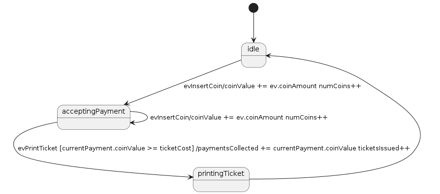

# README
Very simple finite state machine in golang.

Based, loosely on FSM from Rational Rhapsody.

## Goals and Non Goals
Goals:
- To provide useful, simple to use FSM for golang
- To follow UML state diagram semantics as far as reasonable for the features implemented.
- Provide concurrent and non-concurrent implementations.

Non Goals:
- Full implementation of UML state machine specification

## Usage

For detailed usage, look at the test cases.

An example of a car park payment meter is shown below:
```go
package main

import (
	"bytes"
	"fmt"
	"os"

	fsm "github.com/johngrange/gofsm"
)

func main() {
	// Set up state machine
	type currentCoinPayment struct {
		numCoins  uint
		coinValue uint
	}
	type paymentMeter struct {
		paymentsCollected uint
		ticketsIssued     uint
		ticketCost        uint
		currentPayment    currentCoinPayment
	}

	var (
		paymentMeterSM                                                             fsm.ImmediateFSM
		idleStateBuilder, acceptingPaymentStateBuilder, printingTicketStateBuilder fsm.StateBuilder
	)

	// car park payment meter model

	paymentMeterData := &paymentMeter{
		ticketCost: 300,
	}
	stateMachineBuilder := fsm.NewFSMBuilder()
	stateMachineBuilder.SetData(paymentMeterData)

	idleStateBuilder = fsm.NewStateBuilder("idle")
	stateMachineBuilder.GetInitialState().AddTransition(idleStateBuilder)

	acceptingPaymentStateBuilder = fsm.NewStateBuilder("acceptingPayment")

	printingTicketStateBuilder = fsm.NewStateBuilder("printingTicket")

	idleStateBuilder.AddTransition(acceptingPaymentStateBuilder).SetTrigger("evInsertCoin").SetEffect(
		func(ev fsm.Event, fsmData interface{}, dispatcher fsm.Dispatcher) {
			stateData := &(fsmData).(*paymentMeter).currentPayment
			fmt.Printf("stateData: %+v\n", stateData)
			coinAmount := ev.Data().(uint)
			stateData.coinValue += coinAmount
			stateData.numCoins++
			fmt.Printf("stateData: %+v\n", stateData)
		}, "coinValue += ev.coinAmount", "numCoins++", // add labels to effect in plant uml output
	) // parameter is coin value: uint

	acceptingPaymentStateBuilder.AddTransition(acceptingPaymentStateBuilder).SetTrigger("evInsertCoin").SetEffect(
		func(ev fsm.Event, fsmData interface{}, dispatcher fsm.Dispatcher) {
			stateData := &(fsmData).(*paymentMeter).currentPayment
			fmt.Printf("stateData: %+v\n", stateData)

			coinAmount := ev.Data().(uint)
			stateData.coinValue += coinAmount
			stateData.numCoins++

			fmt.Printf("stateData: %+v\n", stateData)
		}, "coinValue += ev.coinAmount", "numCoins++", // add labels to effect in plant uml output
	) // parameter is coin value: uint

	acceptingPaymentStateBuilder.AddTransition(printingTicketStateBuilder).SetTrigger("evPrintTicket").
		SetGuard(func(fsmData, eventData interface{}) bool {
			meterData := (fsmData).(*paymentMeter)

			return meterData.currentPayment.coinValue >= meterData.ticketCost
		}, "currentPayment.coinValue >= ticketCost").
		SetEffect(func(ev fsm.Event, fsmData interface{}, dispatcher fsm.Dispatcher) {
			meter := (fsmData).(*paymentMeter)
			fmt.Printf("Printing ticket for %dp\n", meter.currentPayment.coinValue)
			meter.paymentsCollected += meter.currentPayment.coinValue
			meter.ticketsIssued++
		}, "paymentsCollected += currentPayment.coinValue", "ticketsIssued++")

	acceptingPaymentStateBuilder.OnExit(func(state fsm.State, fsmData interface{}, dispatcher fsm.Dispatcher) {
		fmt.Printf("onExit\n")
		meterData := (fsmData).(*paymentMeter)
		meterData.currentPayment.coinValue = 0
		meterData.currentPayment.numCoins = 0
	})

	printingTicketStateBuilder.AddTransition(idleStateBuilder)

	stateMachineBuilder.
		AddState(idleStateBuilder).
		AddState(acceptingPaymentStateBuilder).
		AddState(printingTicketStateBuilder)

	// replace with stateMachineBuilder.BuildThreadedFSM() for a state
	// machine that will run event management in separate go routine
	// (and therefore automatically progress through guarded transitions when data changes)

	paymentMeterSM, err := stateMachineBuilder.BuildImmediateFSM()
	if err != nil {
		fmt.Println(err)
		return
	}

	const coinAmount = 50
	const customers = 10
	const coinsPerCustomer = 6

	// Set up some tracing
	logger := fsm.NewFSMLogger()
	counter := fsm.NewStateCounter()
	paymentMeterSM.AddTracer(logger)
	paymentMeterSM.AddTracer(counter)

	// Output our state machine in plant uml format
	buf := bytes.Buffer{}

	err = fsm.RenderPlantUML(&buf, paymentMeterSM)
	if err != nil {
		fmt.Println(err)
		return
	}
	err = os.WriteFile("paymentmeter.uml", buf.Bytes(), 0600)
	if err != nil {
		fmt.Println(err)
		return
	}

	// Setup complete, run our state machine
	paymentMeterSM.Start()
	defer paymentMeterSM.Stop()

	for customer := 0; customer < customers; customer++ {
		fmt.Printf("serving customer %d\n", customer)
		fmt.Printf("state: %s\n", paymentMeterSM.CurrentState().Name()) //idle
		for coin := 0; coin < coinsPerCustomer; coin++ {
			fmt.Printf("inserting coin %d\n", coin)
			paymentMeterSM.Dispatch(fsm.NewEvent("evInsertCoin", uint(coinAmount)))
			fmt.Printf("state: %s\n", paymentMeterSM.CurrentState().Name()) //acceptingPayment
		}
		fmt.Printf("state: %s\n", paymentMeterSM.CurrentState().Name()) //acceptingPayment
		paymentMeterSM.Dispatch(fsm.NewEvent("evPrintTicket", nil))
		fmt.Printf("state: %s\n", paymentMeterSM.CurrentState().Name()) //idle
	}
	fmt.Printf("Issued %d tickets, took %d pence\n", paymentMeterData.ticketsIssued, paymentMeterData.paymentsCollected) // 10, 3000

	fmt.Println("State machine log trace")
	for _, l := range logger.Entries {
		fmt.Println(l)
	}

	fmt.Println("Counts of states visited during run")
	for state, count := range counter.StateCounts {
		fmt.Printf("%s: %d\n", state, count)
	}
	fmt.Println("Counts of events discarded during run (arrived when not in state to process them)")
	for event, count := range counter.RejectedEventCounts {
		fmt.Printf("%s: %d\n", event, count)
	}

}

```

## Self Documenting

gofsm can automatically produce PlantUML state machine diagrams.  The example above, will create the diagram below:

